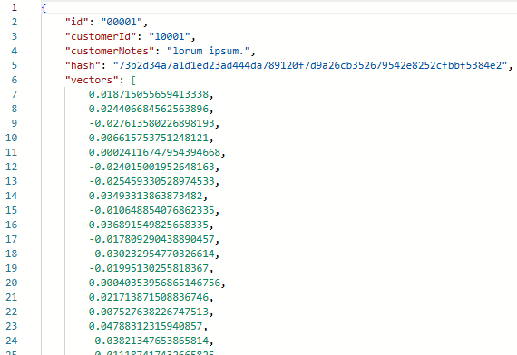

# Azure Cosmos DB Embeddings Generator

This sample shows how to use an Azure Cosmos DB Trigger and Output Binding in Azure Functions to automatically generate Azure OpenAI embeddings on new or updated data.

## This sample demonstrates the following concepts
- Azure Cosmos DB Trigger and Output Bindings for Azure Functions in both C# and Python
- Embedding generation using Azure OpenAI SDK with *text-embedding-3-small* embedding model
- Preventing endless loops in Functions Triggers from in-place document updates by comparing hash values generated on the document.
- Keyless deployment of Azure Functions, Azure Cosmos DB, Azure OpenAI with managed identities and RBAC

## Getting Started:

### Deployment

1. Open a terminal and navigate to where you would like to clone this solution.

1. Navigate to either the `csharp` or `python` directory in this solution.

1. Run the following command to ensure correct permissions to write a `local.settings.json` file locally.

    - If using Windows, open a second Terminal as Administrator and run the following PowerShell command
      ```Powershell
      set-executionpolicy remotesigned
      ```

    - If using Mac or Linux, open Bash and run the following command. This likely requires sudo.
      ```bash
      chmod +x ./infra/scripts/*.sh 
      ```

      Note: This sample deploys using azd. To enable local debugging, a `local.settings.json` file is created in the project directory with the values for the deployed sample in Azure. 

1. From within the `csharp` or `python` directory, deploy the sample to Azure.

```bash
azd up
```

### Post Deployment

1. Check for a `local.settings.json` file in the directory you deployed from. If it does not exist, create a new one using the `sample.settings.json` in the same directory. 
1. Replace the placeholder text for the Cosmos DB and OpenAI Account names below. Use the correct value for `FUNCTIONS_WORKER_RUNTIME`

```json
{
  "IsEncrypted": false,
  "Values": {
    "AzureWebJobsStorage": "UseDevelopmentStorage=true",
    "FUNCTIONS_WORKER_RUNTIME": "python", //"dotnet-isolated"
    "COSMOS_CONNECTION__accountEndpoint": "https://{my-cosmos-account}.documents.azure.com:443/",
    "OPENAI_ENDPOINT": "https://{my-open-ai-account}.openai.azure.com/",
    "COSMOS_DATABASE_NAME": "embeddings-db",
    "COSMOS_CONTAINER_NAME": "customer",
    "COSMOS_VECTOR_PROPERTY": "vectors",
    "COSMOS_HASH_PROPERTY": "hash",
    "COSMOS_PROPERTY_TO_EMBED": "customerNotes",
    "OPENAI_DEPLOYMENT_NAME": "text-3-small",
    "OPENAI_DIMENSIONS": "1536"
  }
}
```

## Quick-Start:

1. Open a browser to Azure Portal. Locate the resource group for the deployed sample.
1. Open the deployed Azure Cosmos DB account and navigate to the `customer` container in Cosmos Data Explorer
1. Create a new document with the same schema as the one below and save.

Example document:
```json
{
   "id": "00001",
   "customerId": "10001",
   "customerNotes": "lorum ipsum."
}
```
1. After clicking Save, the document should reappear with a number of system properties.
1. Press F5 or refresh the browser window and it should then reappear with a hash property and vectors array stored in the document as shown below.
  
    Note: The Functions start-up may miss the first trigger execution. If the embeddings do not appear as below. Make a small change to the same document and save to re-execute the trigger.



## Run locally:

Run the sample locally in a debugger for either the Python or CSharp version that was deployed.

### Python

#### Pre-reqs
1. [Python 3.11](https://www.python.org/) 
1. [Azure Functions Core Tools 4.0.6610 or higher](https://learn.microsoft.com/azure/azure-functions/functions-run-local?tabs=v4%2Cmacos%2Ccsharp%2Cportal%2Cbash#install-the-azure-functions-core-tools)
1. [Azurite](https://github.com/Azure/Azurite)

#### Setup
##### MacOS/Linux/WSL
```bash
python -m venv venv
source venv/Scripts/activate
pip install -r requirements.txt
```

##### Windows
```Powershell
python -m venv venv
source venv\Scripts\activate
pip install -r requirements.txt
```

#### Run the Sample:
1. Ensure you have the Python extension installed. If not, install it from the Extensions view (`Ctrl+Shift+X`).
1. Open the Command Palette (`Ctrl+Shift+P`) and type `Python: Select Interpreter`. Choose the appropriate Python interpreter for your project.
1. Open the `function_app.py` Python file you want to debug.
1. Open the Run and Debug view by clicking the Run icon on the sidebar or pressing `Ctrl+Shift+D`.
1. Click on `create a launch.json file` link to create a new launch configuration.
1. Select `Python` from the list of environments.
1. Press `F5` to start debugging. The Azure Function will start, and execution will pause at any breakpoints you've set.


### CSharp

#### Pre-reqs
1. [.NET 8](https://dot.net/) 
1. [Azure Functions Core Tools 4.0.6610 or higher](https://learn.microsoft.com/azure/azure-functions/functions-run-local?tabs=v4%2Cmacos%2Ccsharp%2Cportal%2Cbash#install-the-azure-functions-core-tools)
1. [Azurite](https://github.com/Azure/Azurite)

#### Run the Sample:
1. Open the csharp project folder in VS Code.
1. Ensure you have the C# extension installed. If not, install it from the Extensions view (`Ctrl+Shift+X`).
1. Open the `CosmosEmbeddingGenerator.cs` file to debug.
1. Set breakpoints by clicking in the gutter to the left of the line numbers.
1. Open the Run and Debug view by clicking the Run icon on the sidebar or pressing `Ctrl+Shift+D`.
1. Click on `create a launch.json file` link to create a new launch configuration.
1. Press `F5` to start debugging. The Azure Function will start, and execution will pause at any breakpoints you've set.